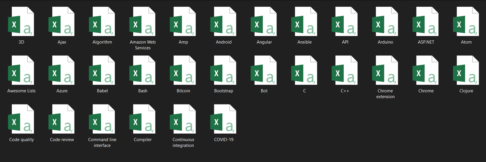

# Github-Topics-Scraper
This is a Web Scraping model that scrapes data from the GitHub topics section, it will also be scraping the top repositories for each topic and creates a CSV file for each topic.

## Usage

### Scrape Top Repositories of Github Topics (Basic)
As soon as you run the [Basic Scraper](https://github.com/SaiJeevanPuchakayala/Github-Topics-Scraper/blob/main/%20Scrape%20Top%20Repositories%20of%20Github%20Topics%20(Basic).ipynb) two files one is Topics.csv and another file is Topics-3D file will be loaded to your current directory as shown below:

### Scrape Top Repositories of Github Topics (Advanced)
As soon as you run the [Advanced Scraper](https://github.com/SaiJeevanPuchakayala/Github-Topics-Scraper/blob/main/Scrape%20Top%20Repositories%20of%20Github%20Topics%20(Advanced).ipynb) a folder called `GithubTopicsData` will be loaded to your current directory as shown below:

And this folder contains `.csv` files with all the top topics with their top repository details as shown below:

> Scrape more topics using [loadmore](https://gist.github.com/SaiJeevanPuchakayala/92c594e3e5f3c8af02c04be11728ec31)
